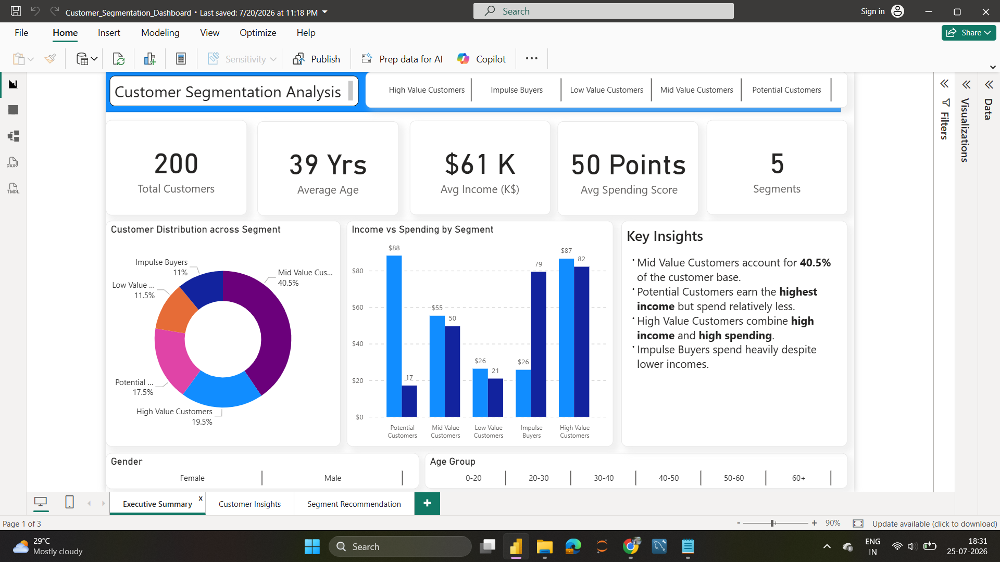
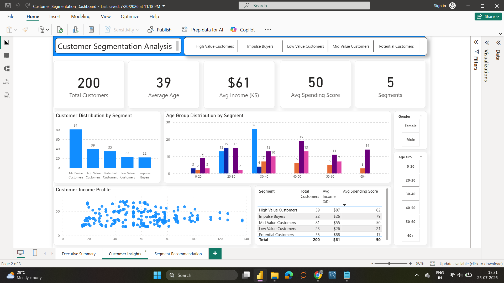
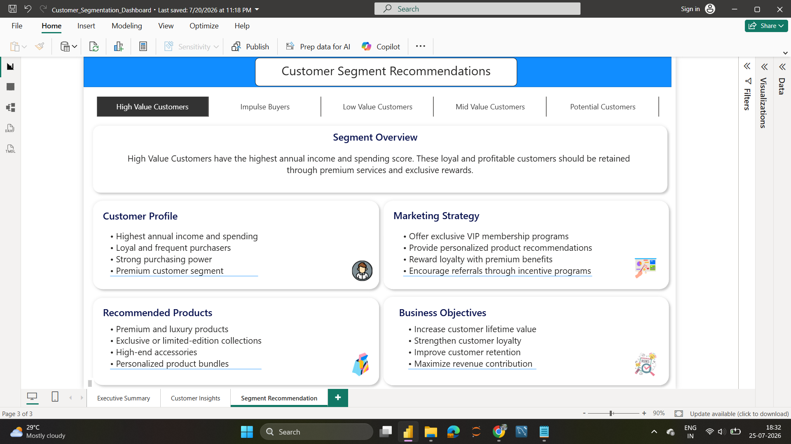
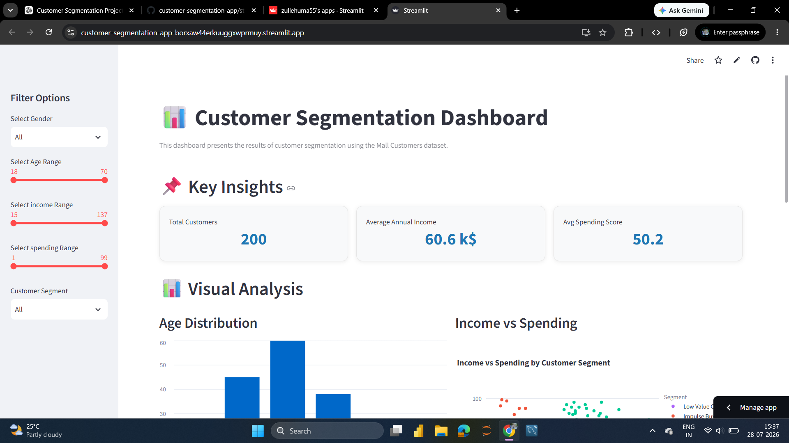
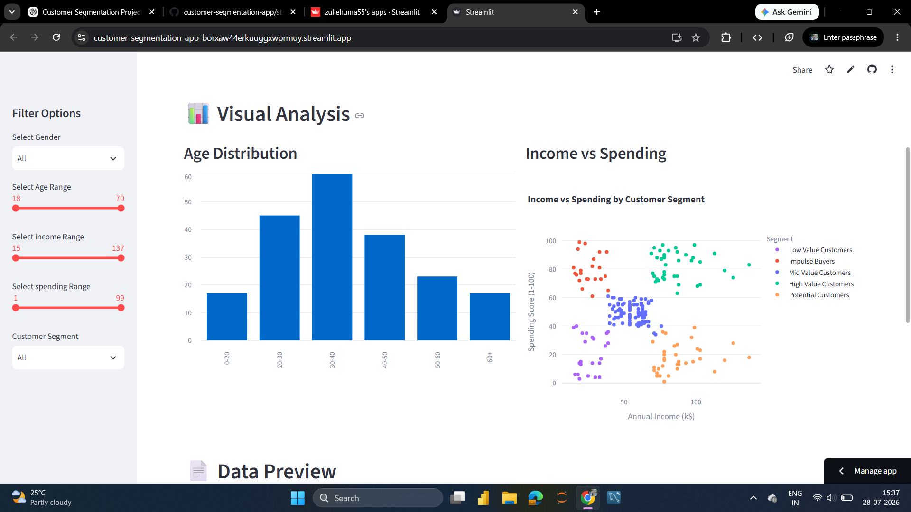
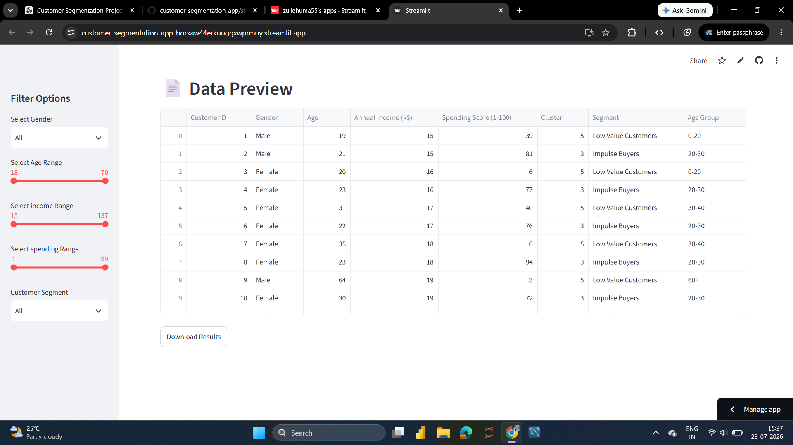

# Customer Segmentation Analysis using Python, SQL, Power BI & Streamlit
Python | Power BI) | SQL | Streamlit | Machine Learning | GitHub

> An end-to-end data analytics project that segments mall customers using K-Means clustering and transforms raw customer data into meaningful business insights through SQL, Power BI, and an interactive Streamlit application.

## 🌐 Live Application

👉 **Try the Streamlit App**

https://customer-segmentation-app-borxaw44erkuuggxwprmuy.streamlit.app/
---
## 📑 Table of Contents

- [Project Overview](#project-overview)
- [Business Problem](#business-problem)
- [Project Objectives](#project-objectives)
- [Dataset Information](#dataset-information)
- [Technology Stack](#technology-stack)
- [Project Workflow](#project-workflow)
- [Key Business Insights](#key-business-insights)
- [Project Preview](#project-preview)
- [Project Structure](#project-structure)
- [How to Run the Project](#how-to-run-the-project)
- [Project Report](#project-report)
- [Skills Demonstrated](#skills-demonstrated)
- [Future Enhancements](#future-enhancements)
- [Author](#author)

## Project Overview

Customer segmentation is a powerful business strategy that enables organizations to understand customer purchasing behaviour, identify high-value customer groups, and design more effective marketing strategies. Instead of treating every customer the same, businesses can group customers with similar characteristics and spending patterns.

In this project, the Mall Customers dataset is analyzed using Python and the K-Means clustering algorithm to identify distinct customer segments. The resulting insights are further explored using SQL, visualized through Power BI dashboards, and presented in an interactive Streamlit application.

This project demonstrates an end-to-end data analytics workflow—from data preparation and exploratory data analysis to machine learning, business intelligence, and interactive reporting.

---
## ⭐ Repository Highlights

✔ End-to-end Data Analytics Project

✔ Machine Learning using K-Means Clustering

✔ SQL Business Insights

✔ Power BI Dashboard

✔ Interactive Streamlit App

✔ Business Recommendations

---

## Business Problem

Retail businesses often have thousands of customers with different purchasing behaviors, income levels, and spending habits. Treating every customer the same can lead to ineffective marketing campaigns, lower customer engagement, and inefficient use of marketing budgets.

Customer segmentation helps businesses identify groups of customers with similar characteristics so that products, promotions, and marketing strategies can be tailored to each segment.

This project demonstrates how data analytics and machine learning can be used to transform raw customer data into meaningful customer segments that support better business decision-making.

---

## Project Objectives

The primary objectives of this project were to:

- Perform exploratory data analysis (EDA) to understand customer demographics and spending behavior.
- Clean and prepare the dataset for machine learning.
- Apply the K-Means clustering algorithm to identify distinct customer segments.
- Analyze customer segments using SQL to generate business insights.
- Build an interactive Power BI dashboard for data visualization.
- Develop a Streamlit application that allows users to explore customer segments dynamically.
- Demonstrate an end-to-end data analytics workflow suitable for real-world business scenarios.

  ---

## Dataset Information
This project uses the **Mall Customers Dataset**, a widely used dataset for customer segmentation analysis.

### Dataset Features

| Feature | Description |
|---------|-------------|
| Customer ID | Unique identifier for each customer |
| Gender | Gender of the customer |
| Age | Age of the customer |
| Annual Income (k$) | Customer's annual income in thousand dollars |
| Spending Score (1–100) | Score assigned based on customer spending behavior |

The dataset contains customer demographic and spending information, making it suitable for applying unsupervised machine learning techniques such as K-Means clustering.

---

## Technology Stack

| Category | Tools & Technologies |
|----------|----------------------|
| Programming Language | Python |
| Data Analysis | Pandas, NumPy |
| Machine Learning | Scikit-learn (K-Means Clustering) |
| Database | MySQL |
| Data Visualization | Power BI, Matplotlib, Seaborn |
| Web Application | Streamlit |
| Version Control | Git & GitHub |
| Development Environment | Visual Studio Code |

---

## Project Workflow

The project follows a structured end-to-end data analytics workflow:

1. **Data Collection**
   - Imported the Mall Customers dataset.

2. **Data Exploration**
   - Performed Exploratory Data Analysis (EDA) to understand customer demographics and spending patterns.

3. **Data Preparation**
   - Checked data quality and prepared the features required for clustering.

4. **Customer Segmentation**
   - Applied the K-Means clustering algorithm to identify customer groups based on Annual Income and Spending Score.

5. **Business Analysis**
   - Used SQL to analyze customer segments and generate meaningful business insights.

6. **Data Visualization**
   - Built an interactive Power BI dashboard to visualize customer behavior and segment distribution.

7. **Interactive Application**
   - Developed a Streamlit application that allows users to explore customer segments dynamically.
---

## Key Business Insights

The customer segmentation analysis revealed several meaningful business insights:

- **High Value Customers** generate the highest spending scores despite representing a smaller portion of the customer base.
- **Mid Value Customers** form the largest customer segment, making them an important group for retention and targeted promotions.
- **Potential Customers** present opportunities for personalized marketing campaigns to increase future spending.
- Customer purchasing behavior varies significantly across different income levels and age groups.
- Segment-wise analysis enables businesses to allocate marketing budgets more effectively and design customer-specific strategies.

These insights demonstrate how data-driven customer segmentation can support better business decision-making and improve marketing effectiveness.
---

## 📸 Project Preview

### 📋 Executive Summary Dashboard



### 📊 Customer Insights Dashboard



### 💡 Customer Segment Recommendations



### 🌐 Streamlit Dashboard



### 🌐 Streamlit Chart



### 🌐 Streamlit Data Download


---

## Project Structure

```text
customer-segmentation-analysis/
│
├── streamlit_app.py
├── README.md
├── requirements.txt
├── data/
├── notebooks/
├── sql/
├── powerbi/
├── report/
├── images/
```

---

## How to Run the Project

1. Clone this repository.

```bash
git clone https://github.com/zullehuma55/customer-segmentation-analysis.git
```

2. Navigate to the project directory.

```bash
cd customer-segmentation-analysis
```

3. Install the required dependencies.

```bash
pip install -r requirements.txt
```

4. Launch the Streamlit application.

```bash
streamlit run streamlit_app.py
```
---
## 📄 Project Report

A detailed report containing:

- Business Problem
- EDA
- Customer Segmentation
- SQL Analysis
- Strategic Recommendations

Available inside the report folder.
---

## Skills Demonstrated

- Data Cleaning & Preparation
- Exploratory Data Analysis (EDA)
- Customer Segmentation using K-Means Clustering
- SQL Query Writing & Business Analysis
- Data Visualization with Power BI
- Interactive Dashboard Development
- Streamlit Application Development
- Business Storytelling
- Data-Driven Decision Making
 
---

## 🚀 Future Enhancements

- Containerize the application using Docker.
- Integrate real-time customer data.
- Experiment with additional clustering algorithms.
- Add customer recommendation features.
- Build an executive KPI dashboard.

---

## 👩‍💻 Author

**Huma Azmath Mohamad**

📊 Data Analyst | Power BI | SQL | Python

- 💼 **LinkedIn:** [Huma Azmath Mohamad](https://www.linkedin.com/in/huma-azmath-mohamad)
- 💻 **GitHub:** [zullehuma55](https://github.com/zullehuma55)

---
Thank you for taking the time to explore this project. Feel free to connect with me on LinkedIn or explore my other projects on GitHub.
